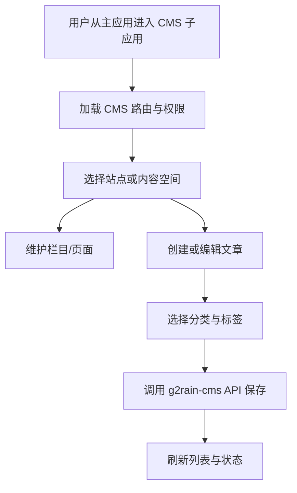



  

# g2rain-cms-app

下一代AI软件开发范式，AI原生Agent平台，开源的企业级SaaS底座。

CMS 内容管理微前端子应用，提供文章、分类、标签、栏目、页面、空间与站点的管理界面；作为 qiankun 子应用接入 g2rain-main-shell，并调用 g2rain-cms 业务 API

[官网](https://www.g2rain.com) · [Issues](https://github.com/g2rain/g2rain/issues) · [Discussions](https://github.com/g2rain/g2rain/discussions)

## 目录

- 项目简介
- 平台定位
- 功能概览
- 功能概览
- 使用场景
- 核心流程
- 流程图
- 技术栈
- 环境要求
- 快速开始
- 配置说明
- 构建与镜像
- 代码质量与测试
- 运行示例
- 安全说明
- 与关联仓库的关系
- 模块说明
- 职责边界
- 常见问题
- 关联仓库
- 参与贡献
- 许可证
- 联系我们
- 致谢

## 项目简介

CMS 内容管理微前端子应用，提供文章、分类、标签、栏目、页面、空间与站点的管理界面；作为 qiankun 子应用接入 g2rain-main-shell，并调用 g2rain-cms 业务 API

## 平台定位

该仓库位于 g2rain 前端业务应用层，承载具体业务域的前端界面与交互流程。

## 功能概览

该仓库聚焦于 `内容管理`。

主要流程包括：
- Shell 启动与路由映射注册流程
- 子应用挂载与卸载生命周期流程
- 子应用路由同步流程
- 令牌请求、响应与失效事件流程
- Qiankun 运行时初始化与多实例子应用编排流程

## 功能概览

| 能力 | 说明 |
| --- | --- |
| 文章管理 | 提供文章列表、分页查询、编辑保存、删除及 Markdown 内容编辑能力。 |
| 分类与标签管理 | 维护文章分类、标签以及文章标签关联关系。 |
| 栏目与页面管理 | 维护栏目、页面及其启停状态，组织站点内容结构。 |
| 站点与空间管理 | 管理 CMS 站点和内容空间，为业务内容提供归属范围。 |
| 微前端接入 | 通过 qiankun 生命周期、Context Path 和平台运行时能力接入主应用。 |

## 使用场景

| 场景 | 说明 |
| --- | --- |
| 运营内容管理 | 当运营人员需要维护文章、分类、标签、栏目和页面时使用。 |
| 多站点内容组织 | 当内容需要按站点与空间进行划分和管理时使用。 |
| 微前端业务接入 | 当 CMS 需要作为独立业务子应用接入 g2rain-main-shell 时使用。 |

## 核心流程

| 流程 | 关键步骤 | 代码线索 |
| --- | --- | --- |
| 文章编辑与发布管理 | 进入文章页面 → 查询文章列表 → 编辑 Markdown 内容 → 选择分类与标签 → 保存文章 → 返回列表刷新状态 | src/views/article、MarkdownEditor、src/runtime/api |
| 内容结构维护 | 选择站点或空间 → 维护栏目与页面 → 调整启停状态 → 调用 CMS API 保存 → 刷新页面数据 | src/views/web_site、space、channel、page |

## 流程图

## 技术栈

| 类别 | 说明 |
| --- | --- |
| 运行时 | Node.js、npm |
| 前端框架 | vue、vue-router、pinia、vue-i18n、element-plus |
| 构建与类型 | vite、typescript、vue-tsc |
| 微前端 | qiankun、vite-plugin-qiankun |
| 接口与模拟 | axios、mockjs、vite-plugin-mock |
| 部署 | Docker、Nginx |

## 环境要求

- Node.js >=22
- npm
- Docker

## 快速开始

| 步骤 | 命令或位置 | 说明 |
| --- | --- | --- |
| 安装依赖 | `npm install` | 根据 package.json 安装前端依赖。 |
| 本地开发 | `npm run dev` | 启动本地开发服务。 |
| 构建产物 | `npm run build` | 执行类型检查与前端构建，生成可发布产物。 |
| 预览产物 | `npm run preview` | 在本地预览构建后的前端产物。 |
| 容器化 | `docker build .` | 仓库提供 Dockerfile，可按组织镜像规范封装前端运行镜像。 |

版本号以项目构建配置为准，当前识别为 `0.1.0`。

## 配置说明

### 运行配置

| 配置项 | 说明 |
| --- | --- |
| `VITE_*` | 前端运行时环境变量，通常由 Vite 与部署环境共同注入。 |

### 路由配置

| 配置项 | 说明 |
| --- | --- |
| `Context Path` | 用于控制前端应用在平台或子路径下的访问基准路径。 |

### 部署配置

| 配置项 | 说明 |
| --- | --- |
| `nginx/default.conf.template` | 容器运行时 Nginx 配置模板，用于静态资源访问和请求转发。 |

## 构建与镜像

| 目标 | 命令 | 产物 | 说明 |
| --- | --- | --- | --- |
| 本地开发 | `npm run dev` | 本地开发服务 | 启动前端本地开发服务。 |
| 前端产物 | `npm run build` | `dist` | 执行类型检查与 Vite/TypeScript 构建，生成可发布产物。 |
| 产物预览 | `npm run preview` | 本地预览服务 | 在本地预览构建后的前端静态产物。 |
| 容器镜像 | `docker build .` | 前端运行镜像 | 基于 Dockerfile 封装静态前端运行镜像。 |
| 构建脚本 | `./build.sh` | 脚本定义的构建结果 | 执行仓库提供的构建脚本，承载组织内镜像或发布流程。 |

## 代码质量与测试

| 检查项 | 命令 | 说明 |
| --- | --- | --- |
| Vue 类型检查 | `npm run build` | 构建流程中使用 vue-tsc 检查 Vue 与 TypeScript 类型。 |

## 运行示例

| 示例 | 方法 | 路径 | 用途 | 调用示例 |
| --- | --- | --- | --- | --- |
| 启动 CMS 本地开发 | npm | `npm run dev` | 启动 CMS 子应用，联调业务页面、后端 API 和主应用接入。 | `npm run dev` |
| 构建 CMS 子应用 | npm | `npm run build` | 执行类型检查并生成可部署的前端产物。 | `npm run build` |

## 安全说明

| 主题 | 说明 |
| --- | --- |
| 业务权限 | 文章、站点、栏目和页面操作应结合平台路由权限及后端权限校验。 |
| 内容安全 | Markdown 或富文本内容展示时应过滤不可信 HTML 与脚本。 |
| 认证态传递 | 子应用应复用平台统一令牌与请求封装，不自行持久化独立认证状态。 |

## 与关联仓库的关系

本仓库作为 CMS 业务前端，被 g2rain-main-shell 以微前端子应用方式装载，并与 g2rain-cms 后端协同完成内容管理流程。

## 模块说明

| 模块 | 职责说明 | 代码线索 |
| --- | --- | --- |
| 文章与内容编辑 | 提供文章列表、编辑表单、Markdown 编辑器和文章相关操作。 | src/views/article、src/components/MarkdownEditor |
| 内容组织 | 提供分类、标签和文章标签关系的管理页面。 | src/views/article_category、src/views/tag、src/views/article_tag_relation |
| 站点结构 | 提供栏目、页面、空间和站点管理页面。 | src/views/channel、src/views/page、src/views/space、src/views/web_site |
| 平台运行时 | 承接微前端生命周期、路由、认证态和 HTTP 请求封装。 | src/runtime、src/platform、src/components/micro-app |

## 职责边界

该仓库主要负责：
- 负责具体业务域的前端页面、路由、表单、列表与交互流程
- 负责通过平台认证态和业务 API 完成业务操作体验

该仓库默认不负责：
- 不负责业务数据的服务端持久化与业务规则权威实现
- 不承担微前端主应用的全局布局和子应用编排职责

## 常见问题

| 问题 | 可能原因 | 处理建议 |
| --- | --- | --- |
| 业务页面请求失败 | CMS API 基地址、Context Path、网关路由或令牌配置不一致。 | 检查 VITE_* 配置、子应用路径、网关路由及浏览器请求头。 |
| 子应用无法被主应用加载 | qiankun entry、activeRule 或构建 base 配置不匹配。 | 检查主应用注册信息、Vite base 和 CMS 子应用部署地址。 |

## 关联仓库

| 仓库 | 协作关系 |
| --- | --- |
| g2rain-main-shell | 作为微前端主应用，负责装载子应用并提供统一平台入口。 |

## 参与贡献

我们欢迎所有形式的贡献：Issue 反馈、文档改进、功能建议与代码提交。

推荐流程：

1. Fork 本仓库。
2. 创建特性分支：`git checkout -b feature/your-feature-name`。
3. 提交更改：`git commit -m "Add some feature"`。
4. 推送分支：`git push origin feature/your-feature-name`。
5. 提交 Pull Request。

代码贡献前请尽量补充必要的测试和文档，并确保构建、测试与静态检查通过。

## 许可证

本项目基于 [Apache 2.0许可证](https://github.com/g2rain/g2rain-common/blob/main/LICENSE) 开源。

## 联系我们

- Issues: [GitHub Issues](https://github.com/g2rain/g2rain/issues)
- 讨论: [GitHub Discussions](https://github.com/g2rain/g2rain/discussions)
- 邮箱: g2rain_developer@163.com

## 致谢

感谢所有为 g2rain 项目提交 Issue、代码、文档、建议和使用反馈的开发者们！
