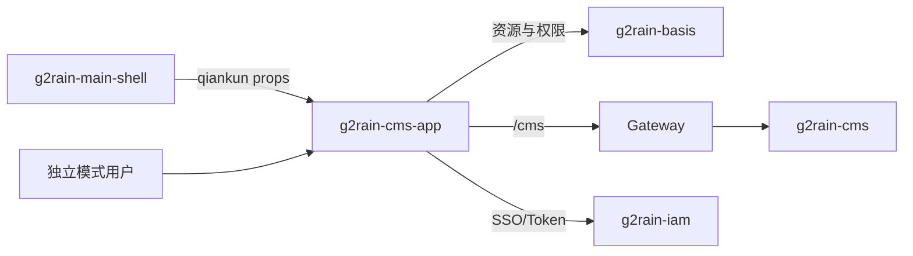

# 架构总览

本项目计划采用 g2rain [`frontend-app 1.0.0`](https://github.com/g2rain/g2rain/tree/architecture-v1.1.0/docs/architecture/profiles/frontend-app)。中央 Profile 管理跨 App 的分层、双运行模式、认证、生成与安全规则；本页描述 CMS 应用的具体实现。

`src/main.ts` 组合 Vue、Store、i18n、权限插件、路由和 qiankun 生命周期。应用启动后从 `/basis/authority/resources` 读取页面、页面元素及 API 资源，再把返回的页面路径映射到 `src/views/route-map.ts` 中的真实组件。

业务边界为管理端交互：权威数据、事务和业务校验属于 `g2rain-cms`；认证属于 IAM；网关鉴权和转发属于 Gateway；全局导航属于 main-shell。

